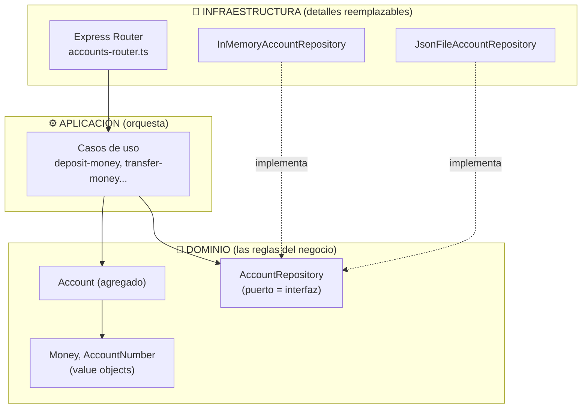

# 🏦 Mini banco — Clean Architecture bien aplicada

Un API de banco (abrir cuenta, depositar, retirar, transferir) hecho a propósito **pequeño**, para que puedas leer TODO el código en una tarde y entender *por qué* cada archivo vive donde vive.

Fue creado como "tercer repositorio" para comparar contra `banking-ddd-nest-master` y `utp`: toma lo mejor de cada uno y corrige sus violaciones a la arquitectura.

---

## 1. La única regla que importa

> **Las dependencias del código apuntan siempre hacia adentro.**
> El dominio no conoce a nadie. La aplicación solo conoce al dominio. La infraestructura conoce a ambos, pero nadie la conoce a ella.



La flecha punteada es el truco completo: **inversión de dependencias**. El dominio *declara* la interfaz `AccountRepository`; la base de datos la *implementa*. Por eso puedes cambiar de memoria → JSON → Postgres sin tocar una línea de lógica.

Y aquí la regla no es un consejo: **está automatizada**. `npm run test:arch` (dependency-cruiser) falla el build si alguien importa Express en el dominio.

## 2. Mapa de carpetas

```
src/
├── app/                          🚀 ARRANQUE (composition root)
│   ├── main.ts                      punto de entrada
│   ├── container.ts                 ÚNICO lugar que conoce las implementaciones
│   └── server.ts                    arma Express
│
├── shared/domain/                🧰 base compartida entre módulos
│   ├── either.ts                    Either<Error, Valor> — errores tipados
│   └── domain-error.ts              base de errores de negocio
│
└── modules/accounts/             📦 un módulo por capacidad de negocio
    ├── domain/                   💎 el centro: CERO imports externos
    │   ├── account.ts               agregado: aquí viven las REGLAS
    │   ├── money.ts                 value object (centavos, nunca floats)
    │   ├── account-number.ts        value object
    │   ├── errors.ts                errores de negocio tipados
    │   ├── account-repository.ts    PUERTO de persistencia
    │   └── account-number-generator.ts  PUERTO de generación
    │
    ├── application/              ⚙️ un archivo = un caso de uso
    │   ├── open-account.use-case.ts
    │   ├── get-account.use-case.ts
    │   ├── deposit-money.use-case.ts
    │   ├── withdraw-money.use-case.ts
    │   └── transfer-money.use-case.ts
    │
    └── infrastructure/           🔌 adaptadores (lo reemplazable)
        ├── http/                    Express: rutas + errores→HTTP
        └── persistence/             memoria, JSON, generador aleatorio

tests/
├── domain/                       tests puros e instantáneos, sin mocks
└── application/                  casos de uso completos con repo en memoria
```

## 3. Sigue el viaje de un depósito

`POST /api/accounts/1111111111/deposits` con `{"amount": 100, "currency": "PEN"}`:

1. **[accounts-router.ts](src/modules/accounts/infrastructure/http/accounts-router.ts)** (infra) — saca los datos crudos del request. No valida nada de negocio; solo traduce HTTP → caso de uso.
2. **[deposit-money.use-case.ts](src/modules/accounts/application/deposit-money.use-case.ts)** (aplicación) — convierte primitivas en value objects (`AccountNumber.create`, `Money.create`): si llega basura, muere aquí con un error tipado. Carga el agregado desde el puerto.
3. **[account.ts](src/modules/accounts/domain/account.ts)** (dominio) — `account.deposit(money)` aplica LA REGLA. Si la moneda no coincide o el monto es cero, devuelve `Left(error)`. El saldo jamás queda inválido.
4. **[in-memory-account-repository.ts](src/modules/accounts/infrastructure/persistence/in-memory-account-repository.ts)** (infra) — persiste. El caso de uso no sabe cuál implementación es.
5. **[http-error-map.ts](src/modules/accounts/infrastructure/http/http-error-map.ts)** (infra) — si algo falló, traduce el `code` del error a un status HTTP (`INSUFFICIENT_FUNDS` → 422). El dominio nunca supo que existía HTTP.

## 4. Las 7 decisiones que hacen "limpio" a este código

| # | Decisión | Dónde verla |
|---|----------|-------------|
| 1 | **Dominio sin frameworks**: `Account` no extiende nada de nadie | `domain/account.ts` |
| 2 | **Dominio rico**: las reglas viven en el agregado, no regadas en servicios | `account.withdraw()` |
| 3 | **Value objects que validan**: un `Money` inválido no puede existir | `domain/money.ts` |
| 4 | **Either tipado**: cada caso de uso declara TODOS sus errores posibles en el tipo de retorno | `DepositMoneyError` |
| 5 | **Puertos y adaptadores**: 2 persistencias intercambiables + generador inyectable | `container.ts` |
| 6 | **DI manual en un solo lugar**: sin magia, se entiende el grafo completo | `app/container.ts` |
| 7 | **Arquitectura verificada por CI**: la regla de dependencia es un test | `.dependency-cruiser.cjs` |

Regla de bolsillo usada en todo el proyecto:

- Fallo de **negocio** (culpa de los datos/el usuario) → `Either<DomainError, T>`
- **Bug** del programador (estado imposible) → `throw new Error(...)`

## 5. Qué corrige respecto a los otros dos repos

| Problema encontrado | banking-ddd-nest | utp | aquí |
|---|---|---|---|
| Dominio acoplado a framework | ❌ `extends AggregateRoot` de @nestjs/cqrs | ⚠️ `shared/domain/crypto` importa crypto-js y config de infra | ✅ dominio con 0 imports externos (verificado por `test:arch`) |
| Aplicación acoplada a detalles | ❌ handlers usan `DataSource`/`QueryRunner` de TypeORM | ❌ un use case genera PDFs con pdfmake y usa `fs` | ✅ casos de uso solo hablan con puertos |
| Tipado de errores/resultados | ⚠️ Result decente, pero se pierde (`boolean`, `console.log` en dominio) | ❌ `Result<any>` con error y valor en el mismo campo | ✅ `Either<Left, Right>` con campos y tipos separados |
| Dominio anémico | ✅ Account tiene reglas reales | ❌ entidades = bolsas de getters, lógica en use cases y repos | ✅ reglas dentro del agregado |
| `any` | casi no | ❌ por todos lados (`Response = any`, `toPrimitives(): any`) | ✅ cero `any`, `strict: true` |
| Repositorios | ✅ enfocados | ❌ un repo mezcla SQL + S3 + queries de otros módulos | ✅ un puerto = una responsabilidad |
| Ceremonia | ❌ ~10 archivos para un depósito (command bus, handlers, mappers...) | ✅ directo | ✅ directo: router → use case → agregado |
| Tests de lógica | ❌ 2 archivos | ❌ 3 (smoke de servidor) | ✅ dominio y casos de uso cubiertos, sin DB |

## 6. Cómo ejecutarlo

```bash
npm install
npm run dev          # levanta en http://localhost:3000 (persistencia en memoria)
PERSISTENCE=json npm run dev   # persiste en data/accounts.json

npm test             # tests de dominio y aplicación (vitest)
npm run test:arch    # verifica la regla de dependencia (dependency-cruiser)
```

Pruébalo:

```bash
# 1. Abrir cuenta (copia el "number" de la respuesta)
curl -X POST http://localhost:3000/api/accounts \
  -H 'Content-Type: application/json' \
  -d '{"holderName":"Ada Lovelace","currency":"PEN"}'

# 2. Depositar
curl -X POST http://localhost:3000/api/accounts/NUMERO/deposits \
  -H 'Content-Type: application/json' -d '{"amount":100,"currency":"PEN"}'

# 3. Retirar más del saldo → 422 con error tipado
curl -X POST http://localhost:3000/api/accounts/NUMERO/withdrawals \
  -H 'Content-Type: application/json' -d '{"amount":9999,"currency":"PEN"}'

# 4. Consultar
curl http://localhost:3000/api/accounts/NUMERO
```

## 7. Checklist para tus propios proyectos

- [ ] ¿Puedo correr los tests de mi lógica de negocio sin base de datos ni red? Si no, hay fugas.
- [ ] ¿`grep -r "express\|sequelize\|typeorm" src/**/domain` devuelve vacío?
- [ ] ¿Cada caso de uso declara en su tipo de retorno todo lo que puede fallar?
- [ ] ¿Podría cambiar la base de datos tocando solo `infrastructure/` y una línea del container?
- [ ] ¿Las entidades protegen sus invariantes o cualquiera les puede setear un estado inválido?
- [ ] ¿Hay algún `any` cruzando fronteras entre capas?

> Lecturas: *Clean Architecture* (Robert C. Martin), *Implementing DDD* (Vaughn Vernon), khalilstemmler.com, CodelyTV (en español).
